# Lock Designs

A drop-in collection of lock screen designs for [Lock Screen Explorer](https://github.com/SirJul1337/omarchy-lock-explorer), the lock screen picker plugin for [Omarchy](https://omarchy.org). Includes fresh QML ports of themes from [Darkkal44/qylock](https://github.com/Darkkal44/qylock) and a handful of original video-wallpaper designs built from [wallsflow.com](https://wallsflow.com) live wallpapers.

[Setup](#setup) • [Gallery](#gallery) • [How it works](#how-it-works) • [Acknowledgements](#acknowledgements) • [License](#license)

## Setup

These designs need Lock Screen Explorer installed first, that plugin is what actually renders the lock screen and the picker UI. This repo only supplies extra content for it.

Clone this repo and run the installer, it installs Lock Screen Explorer if it is missing, then copies these designs into place:

```sh
git clone <this-repo-url> lock-designs
cd lock-designs
./install.sh
```

Open the lock screen picker afterward and check the **Third Party** tab.

If you already have Lock Screen Explorer installed, you can skip the script and just clone straight into place:

```sh
git clone <this-repo-url> ~/.config/omarchy/lock-designs
omarchy-shell lock rescanDesigns
```

## How it works

Any `DesignBase`-derived `.qml` file placed in `~/.config/omarchy/lock-designs/` is auto-discovered by Lock Screen Explorer, no packaging or registration step needed. A `// source: qylock` or `// source: wallsflow` marker comment routes a design into the picker's Third Party tab instead of Styling.

Most of the qylock-ported designs fetch their video/font assets on demand (see the Download button on each card) straight from Darkkal44/qylock's own repo, so this repo stays small. Exception: the wallsflow-sourced designs (the cats and cars) bundle their video directly, wallsflow's CDN blocks scripted downloads, so there is no URL to fetch from later.

## Gallery

### Wallsflow originals

| | | |
|:---:|:---:|:---:|
| **Anime Girl GTR**<br>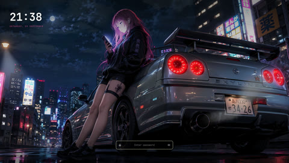 | **Black Cat Water**<br> | **Moonlit Roof Cat**<br> |
| **Nissan 350Z Night**<br> | **Porsche 911 Darkness**<br> | **Supercar Sakura**<br>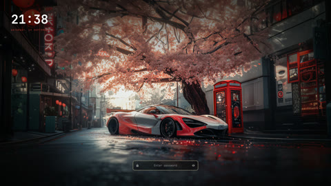 |
| **Skyline R34 Rain** *(local only, see below)*<br> | | |

`SkylineR34Rain.qml` is included in this repo, but its 113MB video is not committed (GitHub's per-file limit is 100MB). It only works if you already have `skyline-r34-rain-assets/bg.mp4` locally.

### Qylock ports

<details>
<summary>38 designs, click to expand</summary>

| | | |
|:---:|:---:|:---:|
| **Clockwork Orbital**<br>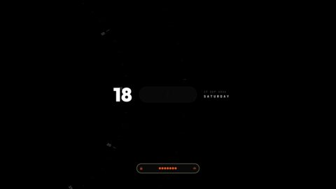 | **Clockwork Neo Orbital**<br>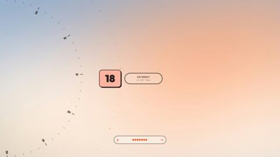 | **Clockwork Tape**<br>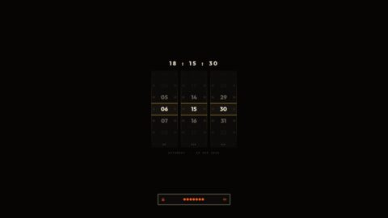 |
| **Dog Samurai**<br>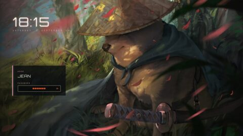 | **Enfield**<br> | **Field**<br> |
| **Forest**<br>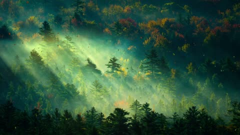 | **Genshin Impact**<br>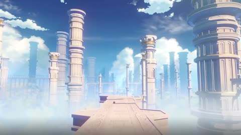 | **Girl Coffee**<br>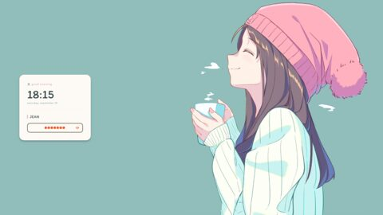 |
| **Girl Pillow**<br> | **The Last of Us**<br>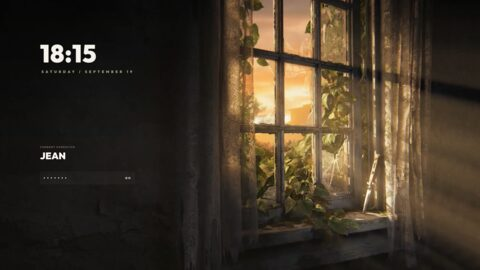 | **Man Bicycle**<br> |
| **Material You**<br>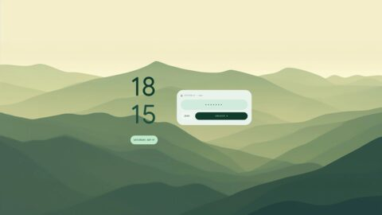 | **Material You Dark**<br>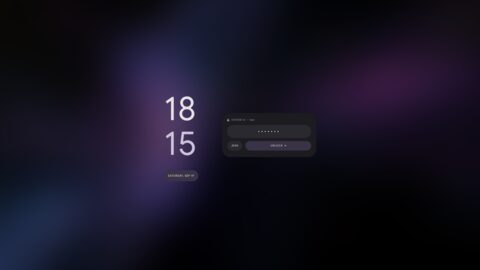 | **Minecraft**<br>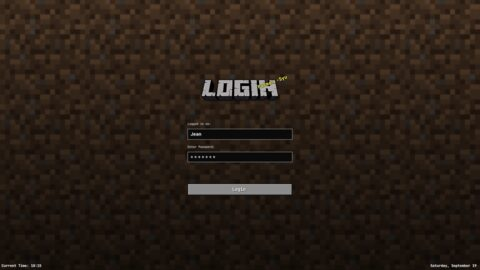 |
| **NieR: Automata**<br>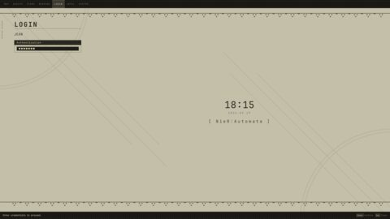 | **Nine Sols**<br>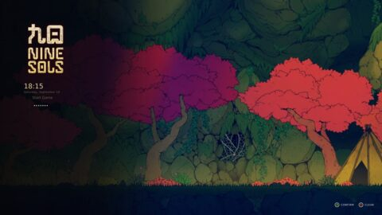 | **Ninja Gaiden**<br> |
| **Nothing**<br> | **Pixel Coffee**<br>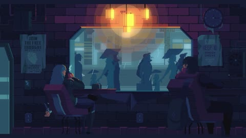 | **Pixel Cyberpunk**<br>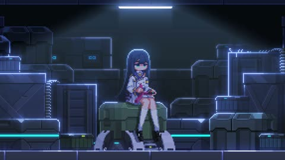 |
| **Pixel Dusk City**<br>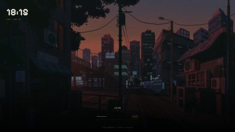 | **Pixel Emerald**<br>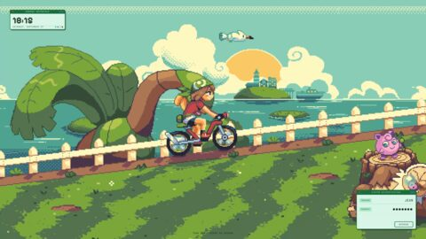 | **Pixel Hollow Knight**<br> |
| **Pixel Munchlax**<br>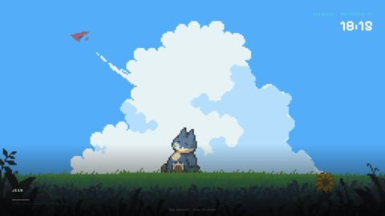 | **Pixel Night City**<br>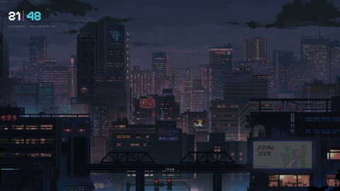 | **Pixel Rainy Room**<br>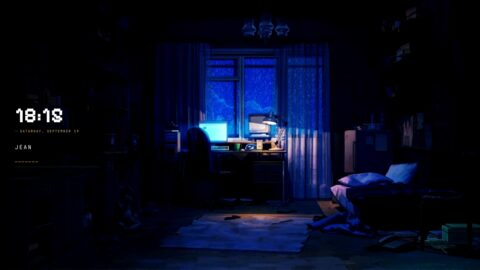 |
| **Pixel Sakura**<br> | **Pixel Skyscrapers**<br>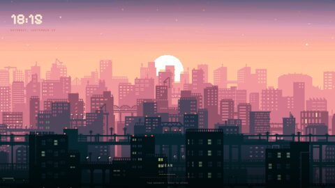 | **Pixel Waterfall**<br>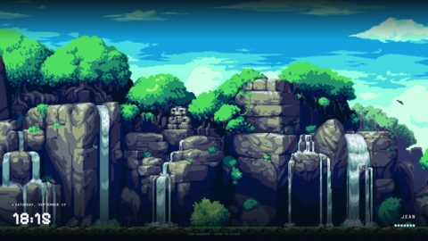 |
| **Reverse: 1999 - I**<br>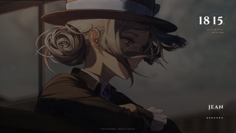 | **Reverse: 1999 - II**<br>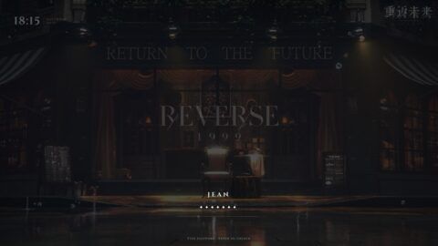 | **Honkai: Star Rail**<br>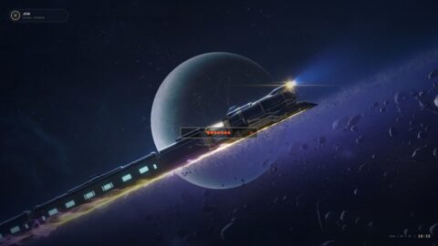 |
| **Sword**<br> | **Terraria**<br>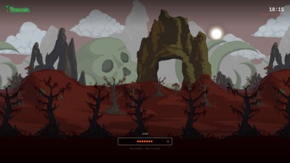 | **Winter**<br> |
| **Women Umbrella**<br> | **Wuthering Waves**<br>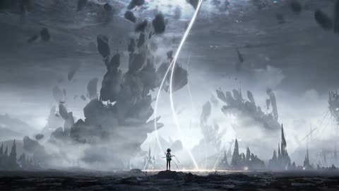 | |

</details>

## Acknowledgements

The QML in this repo is written from scratch against Omarchy's `DesignBase`/`PasswordField`, none of it is copy-pasted from qylock's GPL-3.0 source. The video/image/font assets are a different matter, those are fetched at install time straight from Darkkal44's own hosted copies, so full credit for them (and the original wallpaper artists behind them) belongs there.

| Design | Wallpaper source | Bundled font |
|---|---|---|
| Clockwork (Orbital / Neo Orbital / Tape) | [WallsFlow](https://wallsflow.com/live-wallpapers/abstract/321-clock-mechanism-live-wallpaper.html) | Outfit |
| Dog Samurai | [MoeWalls](https://moewalls.com/others/doge-samurai-crying-live-wallpaper/) | Orbitron |
| Enfield | [WallsFlow](https://wallsflow.com/live-wallpapers/games/777-arknights-endfield-sakura-sanctuary-live-wallpaper.html) | Orbitron |
| Field | [MoeWalls](https://moewalls.com/anime/fading-away-live-wallpaper/) | Orbitron |
| Forest | [MoeWalls](https://moewalls.com/landscape/in-the-early-morning-forest-live-wallpaper/) | Figtree |
| Genshin Impact | [YouTube](https://www.youtube.com/watch?v=XG3vTgitBLE) | - |
| Girl Coffee | [MoeWalls](https://moewalls.com/anime/chill-afternoon-girl-live-wallpaper/) | Itim |
| Girl Pillow | [MoeWalls](https://moewalls.com/anime/lazy-afternoon-girl-live-wallpaper/) | Itim |
| The Last of Us | [MoeWalls](https://moewalls.com/games/the-last-of-us-sunset-live-wallpaper/) | Outfit |
| Man Bicycle | [MoeWalls](https://moewalls.com/landscape/traveling-with-the-bicycle-live-wallpaper/) | Itim |
| Material You / Dark | - | Google Sans |
| Minecraft | Minecraft Wiki | - |
| NieR: Automata | [Reddit](https://www.reddit.com/r/nier/comments/7nqcy7/the_final_nier_automata_title_screen_made_into/) | - |
| Nine Sols | - | DejaVu Sans |
| Ninja Gaiden | [Noisy Pixel](https://noisypixel.net/ninja-gaiden-4-wallpapers-art-team/) | Tektur |
| Nothing | - | NDot55 / NType82 |
| Pixel Coffee | [MoeWalls](https://moewalls.com/pixel-art/cyberpunk-coffee-pixel-live-wallpaper/) | Pixelify Sans |
| Pixel Cyberpunk | [Pixiv](https://www.pixiv.net/en/artworks/84120766) | Pixelify Sans |
| Pixel Dusk City | [WallsFlow](https://wallsflow.com/live-wallpapers/pixel-art/505-pixel-dusk-city-retro-anime-streets-live-wallpaper.html) | Pixelify Sans |
| Pixel Emerald | - | Pixelify Sans |
| Pixel Hollow Knight | [MoeWalls](https://moewalls.com/pixel-art/hollow-knight-3-live-wallpaper/) | Pixelify Sans |
| Pixel Munchlax | [MoeWalls](https://moewalls.com/pixel-art/munchlax-sleeping-on-the-field-pixel-live-wallpaper/) | Pixelify Sans |
| Pixel Night City | [WallsFlow](https://wallsflow.com/live-wallpapers/pixel-art/400-night-city-pixel-art-cyberpunk-live-wallpaper.html) | Pixelify Sans |
| Pixel Rainy Room | [MoeWalls](https://moewalls.com/pixel-art/pixel-room-rainy-night-live-wallpaper/) | Pixelify Sans |
| Pixel Sakura | - | Pixelify Sans |
| Pixel Skyscrapers | [WallsFlow](https://wallsflow.com/live-wallpapers/pixel-art/61-pixel-city.html) | Pixelify Sans |
| Pixel Waterfall | - | Pixelify Sans |
| Reverse: 1999 (I / II) | [Taptap](https://www.taptap.com/topic/21175628) | Cinzel |
| Honkai: Star Rail | [YouTube](https://www.youtube.com/watch?v=Pz7Tu25EyXI) | - |
| Sword | [WallsFlow](https://wallsflow.com/live-wallpapers/anime/761-silent-katana-forest-samurai-live-wallpaper.html) | The Last Shuriken |
| Terraria | [Terraria Forums](https://forums.terraria.org/index.php?threads/terraria-desktop-wallpapers.12644/) | - |
| Winter | [MoeWalls](https://moewalls.com/landscape/winter-forest-snow-live-wallpaper/) | Orbitron |
| Women Umbrella | [MoeWalls](https://moewalls.com/anime/women-with-umbrella-live-wallpaper/) | Itim |
| Wuthering Waves | [YouTube](https://www.youtube.com/watch?v=xKKqi1zLrZ4) | Orbitron |

### Wallsflow originals

Videos bundled directly in this repo (wallsflow's CDN blocks scripted downloads, so there is no on-demand fetch option for these).

| Design | Wallpaper source |
|---|---|
| Black Cat Water | [WallsFlow](https://wallsflow.com/live-wallpapers/animals/886-black-cat-emerald-water-ripples-live-wallpaper.html) |
| Moonlit Roof Cat | [WallsFlow](https://wallsflow.com/live-wallpapers/animals/1075-moonlit-rooftop-cat-live-wallpaper.html) |
| Anime Girl GTR | wallsflow.com (link pending) |
| Nissan 350Z Night | wallsflow.com (link pending) |
| Skyline R34 Rain | wallsflow.com (link pending) |
| Supercar Sakura | wallsflow.com (link pending) |
| Porsche 911 Darkness | wallsflow.com (link pending) |

## License

The QML in this repo is original work. The qylock-ported designs are inspired by [Darkkal44/qylock](https://github.com/Darkkal44/qylock) (GPL-3.0) but written fresh, not copied, per that license's terms for derivative works, and their bundled assets remain Darkkal44's to license since this repo only links to Darkkal44's own hosted copies rather than redistributing them itself. [Lock Screen Explorer](https://github.com/SirJul1337/omarchy-lock-explorer) itself is MIT licensed, by SirJul1337.
