# Lock Designs


45 extra lock screen designs for [Lock Screen Explorer](https://github.com/SirJul1337/omarchy-lock-explorer)'s Third Party tab: 38 fresh QML ports of themes from [Darkkal44/qylock](https://github.com/Darkkal44/qylock), plus 7 original video wallpaper designs built from [wallsflow.com](https://wallsflow.com) live wallpapers. Also throws in one original design, Starry City, a procedural pixel skyline that follows your active Omarchy theme.

[Install](#install) • [Settings](#settings) • [Remove](#remove) • [Gallery](#gallery) • [Acknowledgements](#acknowledgements) • [Development](#development)

## Install

```sh
omarchy plugin add https://github.com/SmoothPixels/lock-designs.git --enable
```

This plugin only supplies content, it does nothing on its own. It requires [Lock Screen Explorer](https://github.com/SirJul1337/omarchy-lock-explorer) to actually render the lock screen and its picker:

```sh
omarchy plugin add https://github.com/SirJul1337/omarchy-lock-explorer.git --enable
```

Order does not matter, install both, then open the lock screen picker and check the **Third Party** tab. Most designs need their video/font assets downloaded first (a Download button on each card), that keeps this plugin small since those assets are fetched straight from Darkkal44's own hosted files rather than bundled here. The wallsflow-sourced designs (the cats and cars) work immediately, their video is bundled directly.

## Settings

None. This is a `service`-kind plugin with no UI or configuration of its own, it just places design files where Lock Screen Explorer looks for them.

## Remove

```sh
omarchy plugin remove io.github.smoothpixels.lock-designs
```

This does not delete the files already copied into `~/.config/omarchy/lock-designs/`, that folder is shared with Lock Screen Explorer's own drop-in mechanism, so removing the plugin should not break anything currently in use. Delete the ones this plugin added yourself if you want them gone, being careful not to remove any of your own custom designs mixed into that same folder.

## Gallery

### Wallsflow originals

| | | |
|:---:|:---:|:---:|
| **Anime Girl GTR**<br> | **Black Cat Water**<br>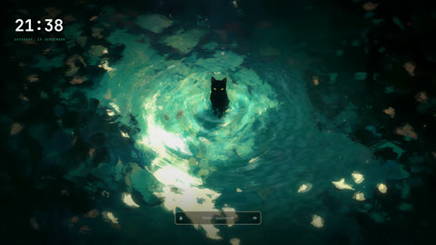 | **Moonlit Roof Cat**<br>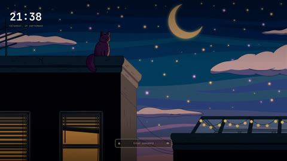 |
| **Nissan 350Z Night**<br>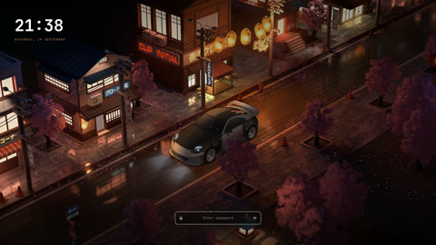 | **Porsche 911 Darkness**<br>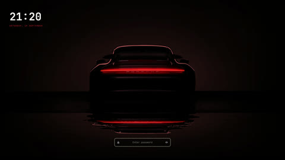 | **Supercar Sakura**<br> |
| **Skyline R34 Rain**<br>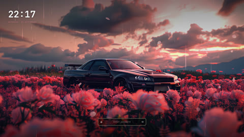 | | |

`SkylineR34Rain.qml`'s video is re-encoded to 1080p (down from the original 4K source, which was 113MB, over GitHub's 100MB per-file limit) to fit in this repo at a fraction of the size with no visible quality loss on a lock screen background.

### Qylock ports

<details>
<summary>38 designs, click to expand</summary>

| | | |
|:---:|:---:|:---:|
| **Clockwork Orbital**<br> | **Clockwork Neo Orbital**<br> | **Clockwork Tape**<br> |
| **Dog Samurai**<br> | **Enfield**<br>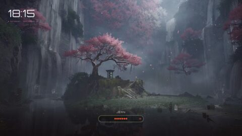 | **Field**<br> |
| **Forest**<br>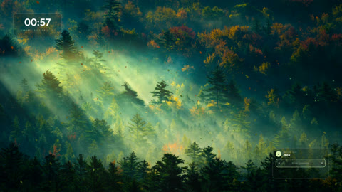 | **Genshin Impact**<br>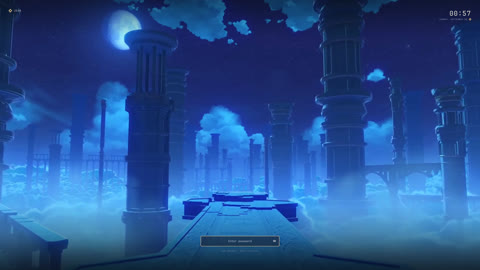 | **Girl Coffee**<br> |
| **Girl Pillow**<br> | **The Last of Us**<br> | **Man Bicycle**<br> |
| **Material You**<br> | **Material You Dark**<br> | **Minecraft**<br> |
| **NieR: Automata**<br> | **Nine Sols**<br> | **Ninja Gaiden**<br> |
| **Nothing**<br> | **Pixel Coffee**<br> | **Pixel Cyberpunk**<br> |
| **Pixel Dusk City**<br>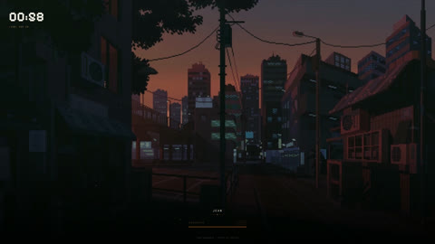 | **Pixel Emerald**<br> | **Pixel Hollow Knight**<br>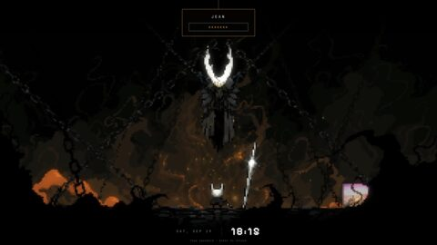 |
| **Pixel Munchlax**<br> | **Pixel Night City**<br> | **Pixel Rainy Room**<br> |
| **Pixel Sakura**<br>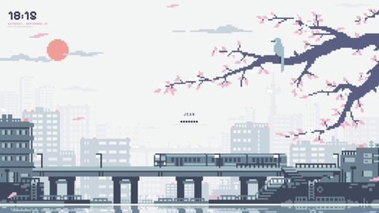 | **Pixel Skyscrapers**<br>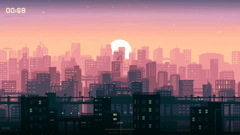 | **Pixel Waterfall**<br> |
| **Reverse: 1999 - I**<br>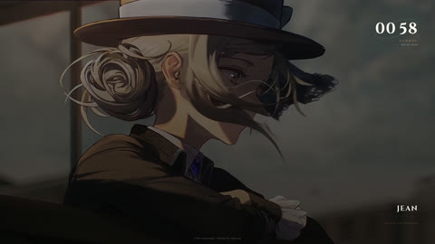 | **Reverse: 1999 - II**<br>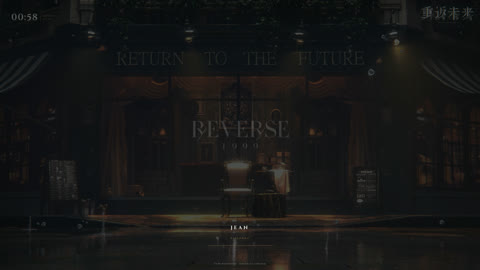 | **Honkai: Star Rail**<br> |
| **Sword**<br>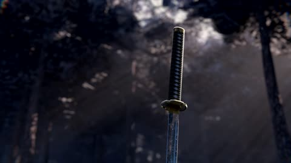 | **Terraria**<br> | **Winter**<br>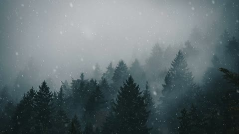 |
| **Women Umbrella**<br> | **Wuthering Waves**<br>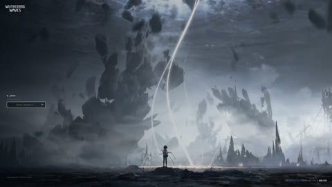 | |

</details>

## Acknowledgements

The QML in this repo is written from scratch against Omarchy's `DesignBase`/`PasswordField`, none of it is copy-pasted from qylock's GPL-3.0 source. The video/image/font assets are a different matter, those are fetched at install time straight from Darkkal44's own hosted copies, so full credit for them (and the original wallpaper artists behind them) belongs there.

| Design | Wallpaper source | Bundled font |
|---|---|---|
| Clockwork (Orbital / Neo Orbital / Tape) | [WallsFlow](https://wallsflow.com/live-wallpapers/abstract/321-clock-mechanism-live-wallpaper.html) | Outfit |
| Dog Samurai | [MoeWalls](https://moewalls.com/others/doge-samurai-crying-live-wallpaper/) | Orbitron |
| Enfield | [WallsFlow](https://wallsflow.com/live-wallpapers/games/777-arknights-endfield-sakura-sanctuary-live-wallpaper.html) | Orbitron |
| Field | [MoeWalls](https://moewalls.com/anime/fading-away-live-wallpaper/) | Orbitron |
| Forest | [MoeWalls](https://moewalls.com/landscape/in-the-early-morning-forest-live-wallpaper/) | Figtree |
| Genshin Impact | [YouTube](https://www.youtube.com/watch?v=XG3vTgitBLE) | - |
| Girl Coffee | [MoeWalls](https://moewalls.com/anime/chill-afternoon-girl-live-wallpaper/) | Itim |
| Girl Pillow | [MoeWalls](https://moewalls.com/anime/lazy-afternoon-girl-live-wallpaper/) | Itim |
| The Last of Us | [MoeWalls](https://moewalls.com/games/the-last-of-us-sunset-live-wallpaper/) | Outfit |
| Man Bicycle | [MoeWalls](https://moewalls.com/landscape/traveling-with-the-bicycle-live-wallpaper/) | Itim |
| Material You / Dark | - | Google Sans |
| Minecraft | Minecraft Wiki | - |
| NieR: Automata | [Reddit](https://www.reddit.com/r/nier/comments/7nqcy7/the_final_nier_automata_title_screen_made_into/) | - |
| Nine Sols | - | DejaVu Sans |
| Ninja Gaiden | [Noisy Pixel](https://noisypixel.net/ninja-gaiden-4-wallpapers-art-team/) | Tektur |
| Nothing | - | NDot55 / NType82 |
| Pixel Coffee | [MoeWalls](https://moewalls.com/pixel-art/cyberpunk-coffee-pixel-live-wallpaper/) | Pixelify Sans |
| Pixel Cyberpunk | [Pixiv](https://www.pixiv.net/en/artworks/84120766) | Pixelify Sans |
| Pixel Dusk City | [WallsFlow](https://wallsflow.com/live-wallpapers/pixel-art/505-pixel-dusk-city-retro-anime-streets-live-wallpaper.html) | Pixelify Sans |
| Pixel Emerald | - | Pixelify Sans |
| Pixel Hollow Knight | [MoeWalls](https://moewalls.com/pixel-art/hollow-knight-3-live-wallpaper/) | Pixelify Sans |
| Pixel Munchlax | [MoeWalls](https://moewalls.com/pixel-art/munchlax-sleeping-on-the-field-pixel-live-wallpaper/) | Pixelify Sans |
| Pixel Night City | [WallsFlow](https://wallsflow.com/live-wallpapers/pixel-art/400-night-city-pixel-art-cyberpunk-live-wallpaper.html) | Pixelify Sans |
| Pixel Rainy Room | [MoeWalls](https://moewalls.com/pixel-art/pixel-room-rainy-night-live-wallpaper/) | Pixelify Sans |
| Pixel Sakura | - | Pixelify Sans |
| Pixel Skyscrapers | [WallsFlow](https://wallsflow.com/live-wallpapers/pixel-art/61-pixel-city.html) | Pixelify Sans |
| Pixel Waterfall | - | Pixelify Sans |
| Reverse: 1999 (I / II) | [Taptap](https://www.taptap.com/topic/21175628) | Cinzel |
| Honkai: Star Rail | [YouTube](https://www.youtube.com/watch?v=Pz7Tu25EyXI) | - |
| Sword | [WallsFlow](https://wallsflow.com/live-wallpapers/anime/761-silent-katana-forest-samurai-live-wallpaper.html) | The Last Shuriken |
| Terraria | [Terraria Forums](https://forums.terraria.org/index.php?threads/terraria-desktop-wallpapers.12644/) | - |
| Winter | [MoeWalls](https://moewalls.com/landscape/winter-forest-snow-live-wallpaper/) | Orbitron |
| Women Umbrella | [MoeWalls](https://moewalls.com/anime/women-with-umbrella-live-wallpaper/) | Itim |
| Wuthering Waves | [YouTube](https://www.youtube.com/watch?v=xKKqi1zLrZ4) | Orbitron |

### Wallsflow originals

Videos bundled directly in this repo, wallsflow's CDN blocks scripted downloads, so there is no on-demand fetch option for these.

| Design | Wallpaper source |
|---|---|
| Black Cat Water | [WallsFlow](https://wallsflow.com/live-wallpapers/animals/886-black-cat-emerald-water-ripples-live-wallpaper.html) |
| Moonlit Roof Cat | [WallsFlow](https://wallsflow.com/live-wallpapers/animals/1075-moonlit-rooftop-cat-live-wallpaper.html) |
| Anime Girl GTR | [WallsFlow](https://wallsflow.com/live-wallpapers/anime/1048-anime-girl-nissan-skyline-gtr-live-wallpaper.html) |
| Nissan 350Z Night | [WallsFlow](https://wallsflow.com/live-wallpapers/cars/1083-nissan-350z-japanese-night-streets-live-wallpaper.html) |
| Skyline R34 Rain | [WallsFlow](https://wallsflow.com/live-wallpapers/cars/870-pink-flower-field-nissan-skyline-r34-rain-live-wallpaper.html) |
| Supercar Sakura | [WallsFlow](https://wallsflow.com/live-wallpapers/cars/495-supercar-dreamscape-under-sakura-blossoms.html) |
| Porsche 911 Darkness | [WallsFlow](https://wallsflow.com/live-wallpapers/cars/756-porsche-911-timeless-performance-in-darkness-live-wallpaper.html) |

Lock Screen Explorer itself is [MIT licensed](https://github.com/SirJul1337/omarchy-lock-explorer), by SirJul1337.

## Development

Any `DesignBase`-derived `.qml` file dropped in `designs/` shows up automatically once copied into `~/.config/omarchy/lock-designs/`. A `// source: qylock` or `// source: wallsflow` marker comment (first line) routes it into the picker's Third Party tab instead of Styling. Qylock ports that fetch assets on demand need an entry in `designs/thirdparty-assets.json`, pointing at the real files in Darkkal44's repo.

Validate before publishing:

```sh
omarchy plugin validate ~/.config/omarchy/plugins/io.github.smoothpixels.lock-designs
qmllint -I "$OMARCHY_PATH/shell" Service.qml
```

See [NOTICE.md](NOTICE.md) for the full licensing picture.
